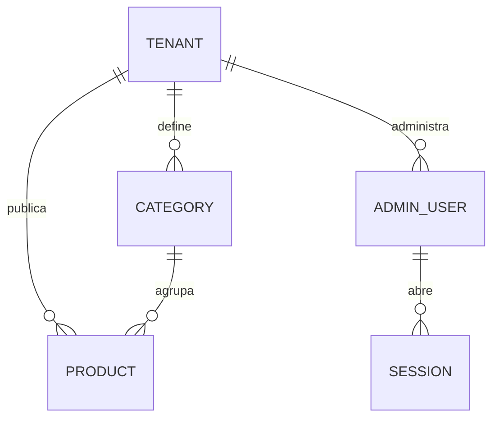

# Mapa del Sistema — Catálogo Web Multi-Emprendimiento

> Este documento es el **mapa de orientación arquitectónica** del sistema. Es co-mantenido por los skills `arquitecto-sdd` e `ing-requisitos-sdd` y consultado al inicio de cada análisis de requerimientos. Refleja el estado del sistema en su última actualización.
>
> **No editar manualmente sin coordinar.** Para refrescarlo, invocar al Arquitecto SDD o al Ingeniero de Requisitos.
>
> **Estado actual: arquitectura OBJETIVO (greenfield).** Al momento de esta versión no existe código; todo lo descrito es el diseño aprobado que construyen las tareas CAT-01…CAT-11. Cuando exista código, el código manda sobre este mapa.

---

## Metadatos

- **Última actualización:** 2026-09-14 22:30
- **Generado por:** skill arquitecto-sdd
- **Commit del repo en el momento del scan:** N/A — el directorio no es repositorio git (se inicializa en CAT-01)
- **Tipo de scan:** Construcción colaborativa para greenfield
- **Versión del Mapa:** v1.0

---

## 1. Visión General del Sistema

Motor de **catálogo web reutilizable entre emprendimientos** (multi-tenant). Cada emprendimiento (tenant) tiene su link público, su marca (nombre, logo, color), su número de WhatsApp y su catálogo. El cliente final navega desde el celular (llega por Instagram/WhatsApp), arma un carrito en su propio navegador y confirma el pedido con un mensaje prellenado a WhatsApp. No hay pago online, reservas ni cuentas de cliente: el cierre de la venta ocurre por WhatsApp.

Usuarios: (1) **Administrador del tenant** — uno por emprendimiento, carga y edita productos desde un panel con usuario y contraseña, optimizado para celular; (2) **Cliente final** — anónimo. El alta de tenants, categorías y administradores la hace el desarrollador por línea de comandos (no hay panel de superadministrador).

Tenants iniciales: **BANNED** (vapes: modelo con precio único, puffs y sabores elegibles; aviso +18) y **miphone** (reventa Apple: categorías con atributos propios, stock por unidad o por cantidad, precios en USD o ARS).

Conceptos de dominio centrales: **Tenant**, **Categoría** (define atributos y opción elegible), **Producto**, **Atributo** (valor fijo del producto: puffs, batería, capacidad…), **Opción elegible** (el cliente la elige al comprar: sabor), **Modo de stock** (disponibilidad / unidad única / cantidad), **Carrito** (local), **Pedido** (mensaje de WhatsApp), **Administrador**, **Sesión**.

---

## 2. Stack Tecnológico

### 2.1 Lenguajes y Runtimes
- **Backend:** TypeScript sobre Cloudflare Workers (runtime workerd).
- **Frontend:** TypeScript + React 19 (SPA).
- **Scripts/Tooling:** Node.js 22 LTS + npm 10 (`package-lock.json`); scripts CLI en TypeScript ejecutados con `tsx`.

### 2.2 Frameworks Principales
- **Web (API):** Hono, montado en el Worker.
- **Web (UI):** React Router en modo *data* (`createBrowserRouter`, rutas del panel con `lazy`), Tailwind CSS v4 (`@tailwindcss/vite`).
- **Validación:** Zod (esquemas compartidos entre UI, Worker y scripts).
- **Acceso a datos:** SQL directo sobre el binding D1 (`prepare().bind()`), encapsulado en repositorios. Sin ORM.
- **Testing:** Vitest; `@testing-library/react` + jsdom (unit/UI); `@cloudflare/vitest-pool-workers` (integración del Worker con D1/KV locales).
- **Build/Bundling:** Vite + `@cloudflare/vite-plugin` (el Worker corre en workerd durante `vite dev`).
- **Lint/Format:** ESLint (flat config, typescript-eslint, react-hooks) + Prettier.

### 2.3 Persistencia
- **Base de datos principal:** Cloudflare D1 (SQLite), base `catalogo-db`, binding `DB`. Plan Free: 500 MB por base, 5 M filas leídas/día, 100 K filas escritas/día, Time Travel 7 días.
- **Imágenes:** Cloudflare Workers KV, namespace `catalogo-images`, binding `IMAGES`. Claves inmutables; metadata `{ contentType }`. Plan Free: 1 GB, 100 K lecturas/día, 1 K escrituras/día. Acceso detrás de la interfaz `ImageStore` (reemplazable por R2).
- **Carrito del cliente y aceptación +18:** `localStorage` del navegador del cliente.

### 2.4 Infraestructura y Despliegue
- **Containerización:** ninguna.
- **CI/CD:** ninguno en v1; despliegue manual con `npm run deploy` desde la máquina del desarrollador.
- **Cloud / Hosting:** Cloudflare Workers plan Free (uso comercial permitido) con Workers Static Assets para la SPA. URL pública: `https://catalogo.<subdominio>.workers.dev/<slug>`. Sin dominio propio.
- **Observabilidad:** Workers Logs (`observability.enabled`) + `wrangler tail`.

### 2.5 Integraciones Externas
- **WhatsApp click-to-chat:** `https://wa.me/<número>?text=<mensaje>`; solo un link, sin API.

---

## 3. Estructura del Repositorio

```
./
├── docs/specs/            ← artefactos del pipeline SDD (contratos, arquitectura, planes)
├── migrations/            SQL de D1 versionado (0001_tenants, 0002_catalog, 0003_auth)
├── public/                estáticos (favicon, placeholder de producto)
├── scripts/               CLI de aprovisionamiento (tenant.ts, admin.ts, seed-dev.ts) + lib/ + fixtures/
├── tenants/               configuración de cada tenant en JSON (sin secretos): banned.json, demo.json, miphone.json
├── src/
│   ├── shared/            código isomórfico (UI + Worker + scripts)
│   │   ├── types/         tipos del dominio y DTOs de la API
│   │   ├── schemas/       esquemas Zod
│   │   ├── domain/        lógica pura: money, visibility, attributes, cart, whatsapp, filters, color
│   │   ├── crypto/        hash de contraseñas (PBKDF2, WebCrypto)
│   │   └── constants.ts
│   ├── worker/            Cloudflare Worker (Hono)
│   │   ├── index.ts, app.ts
│   │   ├── routes/        un archivo por grupo de endpoints
│   │   ├── middleware/    require-admin, same-origin, security-headers
│   │   ├── services/      reglas de negocio (catálogo, auth, productos, imágenes)
│   │   ├── repositories/  SQL sobre D1, un archivo por tabla
│   │   ├── lib/           errores, ids, json, constantes del Worker
│   │   └── test/          setup de migraciones y factories para tests de integración
│   └── web/               SPA React
│       ├── main.tsx, router.tsx, index.css
│       ├── api/           cliente HTTP (public.api, admin.api)
│       ├── shared/        componentes UI genéricos, hooks, storage seguro, theme
│       └── features/      tenant/, catalog/, cart/, admin/ (pages, components, hooks, lib)
├── index.html, vite.config.ts, vitest.config.ts, vitest.workers.config.ts, wrangler.jsonc
├── tsconfig.json (+ .app / .worker / .node)
└── package.json, README.md
```

### Convenciones de organización
- **Capas del Worker:** `routes` (HTTP + validación Zod) → `services` (reglas) → `repositories` (SQL). Las rutas no ejecutan SQL; los repositorios no conocen HTTP.
- **Dependencias:** `shared` no importa de `worker` ni de `web`. `web` y `worker` no se importan entre sí; se comunican solo por HTTP y por los tipos de `shared/types`.
- **Types, schemas y constantes en archivos propios**, nunca inline en un service/componente (salvo tipos privados de ese archivo).
- **Helpers:** lo usa un solo feature → `features/<feature>/lib`; lo usan UI y Worker → `src/shared/domain`; solo UI → `src/web/shared`.
- **Naming:** archivos TS en kebab-case con sufijo de rol (`products.repo.ts`, `auth.service.ts`, `public.routes.ts`, `tenant.schema.ts`); componentes React en PascalCase (`ProductCard.tsx`); hooks `useX.ts`.
- **Idioma:** código (identificadores) en inglés; textos de UI, mensajes al usuario y documentación en español.
- **Tests colocados** junto al archivo que prueban: `*.test.ts` / `*.test.tsx`.

### Proyectos hermanos / dependencias multi-repo
Ninguna — el sistema es autocontenido en este repo.

---

## 4. Modelos de Dominio

### 4.1 Entidades centrales

| Entidad | Propósito | Archivo principal | Relaciones clave |
|---|---|---|---|
| Tenant | Emprendimiento: slug, marca, WhatsApp, moneda por defecto, flags `age_gate`/`noindex` | `migrations/0001_tenants.sql`, `src/shared/types/tenant.types.ts` | tiene-muchas Categorías, Productos, Admins |
| Category | Familia de productos; define `attribute_schema` (JSON), `choice_label`, modo de stock y moneda por defecto | `migrations/0002_catalog.sql`, `src/shared/types/catalog.types.ts` | pertenece-a Tenant; tiene-muchos Productos |
| Product | Ítem del catálogo: precio en centavos + moneda, `stock_mode`, `stock_qty`, `status`, `attributes` (JSON), `choices` (JSON) | ídem | pertenece-a Tenant y Category |
| AdminUser | Administrador de un tenant (usuario único global, hash PBKDF2, bloqueo por intentos) | `migrations/0003_auth.sql` | pertenece-a Tenant; tiene-muchas Sesiones |
| Session | Sesión opaca: guarda SHA-256 del token, vence a 30 días | ídem | pertenece-a AdminUser y Tenant |
| Imagen (KV) | Foto en 2 tamaños (`<base>-480`, `<base>-1200`) o logo | `src/worker/services/images/` | referenciada por Product.image_key / Tenant.logo_key |

### 4.2 Diagrama ER (resumen)



### 4.3 Esquema de base de datos
- **Migraciones:** `migrations/NNNN_nombre.sql`, aplicadas con `wrangler d1 migrations apply catalogo-db --local|--remote`. Nunca se edita una migración ya aplicada: siempre una nueva.
- **Convenciones:** tablas en plural snake_case; PK `id TEXT` (UUID v4); `tenant_id` en toda tabla de datos de negocio; timestamps `created_at`/`updated_at` TEXT UTC (`datetime('now')`); booleanos `INTEGER 0/1`; JSON en columnas `TEXT` validado con Zod en la aplicación; dinero en `price_cents INTEGER` + `currency`. Sin soft-delete (el estado `sold`/`paused` cubre el ciclo de vida).
- **Regla de aislamiento:** toda consulta de administración filtra por el `tenant_id` de la sesión; los repositorios reciben `tenantId` como parámetro obligatorio.

---

## 5. APIs y Contratos

### 5.1 APIs HTTP expuestas

| Grupo | Prefijo | Propósito | Archivo principal |
|---|---|---|---|
| Catálogo público | `GET /api/public/tenants/:slug/catalog` | Marca + categorías + productos visibles de un tenant (`no-store`) | `src/worker/routes/public.routes.ts` |
| Auth admin | `/api/admin/login`, `/logout`, `/me` | Sesión por cookie `__Host-cat_session` | `src/worker/routes/admin-auth.routes.ts` |
| Productos admin | `/api/admin/categories`, `/api/admin/products[/:id][/status][/sale]` | ABM del tenant de la sesión | `src/worker/routes/admin-products.routes.ts` |
| Imágenes admin | `POST /api/admin/images` | Subida de las 2 variantes ya comprimidas | `src/worker/routes/admin-images.routes.ts` |
| Imágenes públicas | `GET /img/*` | Sirve desde KV, caché inmutable 1 año | `src/worker/routes/images.routes.ts` |
| HTML por tenant | navegación `/<slug>`, `/admin*` | `index.html` con title/OG/robots y headers de seguridad | `src/worker/routes/html.routes.ts` |

Formato de error uniforme: `{ "error": { "code": "VALIDATION_ERROR", "message": "…", "details"?: … } }`.

### 5.2 Eventos publicados/consumidos
Ninguno.

### 5.3 Contratos internos relevantes
- `src/shared/types/api.types.ts`: DTOs `PublicCatalogResponse`, `AdminProduct`, etc. Fuente única para UI y Worker.
- `src/shared/domain/visibility.ts`: regla única de visibilidad pública (`getHiddenReason`), usada por el Worker y por el panel.
- `src/shared/domain/whatsapp.ts` y `cart.ts`: armado del pedido; cubiertos por tests con strings exactos.
- `src/worker/services/images/image-store.ts`: interfaz `ImageStore` (put/get/delete). Implementación actual: `kv-image-store.ts`.

---

## 6. Convenciones del Proyecto

### 6.1 Estilo de código
- **Linter:** ESLint, `eslint.config.js`. **Formatter:** Prettier, `.prettierrc.json` (LF, comillas simples, punto y coma, ancho 100).
- TypeScript `strict`; prohibido `any` explícito (usar `unknown` + validación).
- Sin `dangerouslySetInnerHTML`.

### 6.2 Manejo de errores
Worker: se lanza `ApiError(status, code, message, details?)` (`src/worker/lib/errors.ts`); `app.onError` lo traduce al formato uniforme; `ZodError` → 400 `VALIDATION_ERROR`; cualquier otro → 500 `INTERNAL_ERROR` sin detalles. UI: `src/web/api/http.ts` convierte respuestas no-2xx en `HttpError` con `code`.

### 6.3 Logging
`console.log/error` estructurado en JSON (`{ level, msg, ...campos }`) solo en el Worker, visible en Workers Logs. **Nunca** se loguean contraseñas, tokens, cookies ni hashes.

### 6.4 Validación de inputs
Zod en la capa `routes` del Worker para todo body/params/query; los services asumen input validado. Los atributos de producto se validan además contra el `attribute_schema` de su categoría (`src/shared/domain/attributes.ts`). La UI reutiliza los mismos esquemas para validar formularios.

### 6.5 Autenticación y autorización
- **Mecanismo:** usuario + contraseña; hash `pbkdf2-sha256$100000$<salt>$<hash>` (WebCrypto); sesión opaca en D1 (se guarda SHA-256 del token); cookie `__Host-cat_session` HttpOnly, Secure, SameSite=Lax, 30 días. Bloqueo 15 min tras 5 intentos fallidos.
- **Identificación:** middleware `requireAdmin` deja `{ adminUserId, tenantId, username }` en el contexto de Hono.
- **CSRF:** SameSite=Lax + middleware `sameOrigin` (header `Origin` igual al origen del request) en toda mutación.
- **Permisos:** un único rol (admin de su tenant). El tenant nunca se toma del cliente.

### 6.6 Testing
- **Framework:** Vitest.
- **Ubicación y naming:** colocados, `*.test.ts(x)`.
- **Tipos:** unitarios (`src/shared`, `scripts/lib`), UI (`src/web`, jsdom + Testing Library), integración del Worker (`src/worker`, pool de workers con D1/KV locales y migraciones aplicadas en setup).
- **Comandos:** `npm run test:unit`, `npm run test:worker`, `npm test` (ambos), `npm run typecheck`, `npm run lint`.

---

## 7. Módulos Principales

### Módulo: Tenant y marca
- **Propósito:** resolver el tenant por slug y aplicar su marca. **Ubicación:** `src/worker/repositories/tenants.repo.ts`, `src/web/features/tenant/`, `scripts/tenant.ts`. **Estado:** nuevo (CAT-01).

### Módulo: Catálogo público
- **Propósito:** exponer y mostrar productos visibles, categorías, atributos, aviso +18, filtros y buscador. **Ubicación:** `src/worker/services/catalog.service.ts`, `src/web/features/catalog/`. **Depende de:** Tenant. **Estado:** nuevo (CAT-02, CAT-09, CAT-10).

### Módulo: Carrito y pedido
- **Propósito:** carrito local por tenant, reconciliación con el catálogo, mensaje y link de WhatsApp. **Ubicación:** `src/shared/domain/cart.ts`, `whatsapp.ts`, `src/web/features/cart/`. **Depende de:** Catálogo público. **Estado:** nuevo (CAT-03).

### Módulo: Autenticación admin
- **Propósito:** login, sesiones, bloqueo, protección de rutas. **Ubicación:** `src/worker/services/auth.service.ts`, `middleware/`, `src/shared/crypto/password.ts`, `scripts/admin.ts`. **Estado:** nuevo (CAT-04).

### Módulo: Gestión de productos
- **Propósito:** ABM, cambio de estado, registro de ventas, duplicado, formulario dinámico por categoría. **Ubicación:** `src/worker/services/products.service.ts`, `src/web/features/admin/`. **Depende de:** Auth, Catálogo. **Estado:** nuevo (CAT-05, CAT-08, CAT-09).

### Módulo: Imágenes
- **Propósito:** compresión en el navegador, subida validada, almacenamiento en KV, entrega con caché. **Ubicación:** `src/worker/services/images/`, `src/web/features/admin/lib/image-compress.ts`. **Estado:** nuevo (CAT-06).

---

## 7.1. Topología de Microservicios

N/A — aplicación única (un Worker que sirve API + SPA). Arranque local: `npm run db:migrate:local && npm run seed:dev && npm run dev` (Vite + workerd con D1 y KV locales persistidos en `.wrangler/state`). Sin servicios a mockear.

---

## 8. Decisiones Arquitectónicas Vigentes

1. **Hosting en Cloudflare Workers Free** (Vercel Hobby prohíbe uso comercial). Upgrade natural: Workers Paid USD 5/mes.
2. **Una sola instancia multi-tenant con ruteo por path** `/<slug>`; slugs reservados: `admin`, `api`, `img`, `assets`. Si un tenant necesitara aislamiento (p. ej. riesgo regulatorio), se despliega el mismo código en otra cuenta/entorno sin cambios de código.
3. **Producto genérico configurable por datos:** atributos por categoría (`attribute_schema`), una opción elegible por el cliente (`choice_label` + `choices` con disponible sí/no), modo de stock por producto. Un vertical nuevo se agrega con configuración, no con código.
4. **El sistema no descuenta stock ni reserva:** las ventas se registran manualmente en el panel.
5. **Dinero como enteros en centavos + moneda (ARS|USD)**; nunca se convierte ni se suma entre monedas.
6. **Catálogo público sin caché** (`no-store`) para reflejar cambios al instante; **imágenes inmutables** (clave nueva en cada subida) con caché de 1 año.
7. **Filtrado y búsqueda en el navegador** (catálogos de decenas de productos).
8. **Alta de tenants, categorías y admins por CLI** con JSON versionado en `tenants/`; sin panel de superadmin ni de configuración del tenant en v1.
9. **Autenticación propia** (sin proveedor externo) con PBKDF2 al máximo soportado por workerd (100 000 iteraciones) y contraseñas generadas por el CLI.
10. **Imágenes comprimidas en el navegador** del admin (WebP, fallback JPEG) en 480 px y 1200 px antes de subir; el Worker valida tipo por magic bytes y tamaño (≤ 1 MB). SVG prohibido.

---

## 9. Deuda Técnica Conocida

| Área | Descripción | Impacto en nuevos desarrollos |
|---|---|---|
| Imágenes | Subidas que no terminan asociadas a un producto quedan huérfanas en KV | Menor; limpieza opcional futura |
| Auth | PBKDF2 100 000 < recomendación OWASP (600 000) por límite de workerd; login puede exceder los 10 ms de CPU del plan Free | Mitigado con contraseñas generadas y bloqueo; revisar si se pasa a Workers Paid |
| Backups | Solo Time Travel de 7 días; export manual (`wrangler d1 export`) | Documentado en README |

---

## 10. Dependencias Externas Críticas

| Servicio | Propósito | Criticidad | Notas |
|---|---|---|---|
| Cloudflare Workers + Static Assets | Hosting de API y SPA | Alta | Free: 100 K requests/día al Worker (los estáticos no cuentan), 10 ms CPU/request |
| Cloudflare D1 | Datos | Alta | Free: límites diarios aplicados desde 2026-09-01 (errores hasta medianoche UTC si se exceden) |
| Cloudflare Workers KV | Imágenes | Media | Free: 1 GB, 100 K lecturas/día, 1 K escrituras/día |
| WhatsApp (`wa.me`) | Envío del pedido | Alta | Sin API; si no hay app, abre WhatsApp Web |

---

## CHANGELOG del Mapa

- **v1.0 (2026-09-14):** Versión inicial. Construcción colaborativa para greenfield a partir de los contratos `CATALOGO_BASE_VAPERS_ELICITADOR_NUEVO_v1.0.md` y `CATALOGO_APPLE_ELICITADOR_NUEVO_v1.0.md` y de las decisiones de Fase 3 del Arquitecto (ver `CATALOGO_ARQUITECTO_v1.0.md`).
