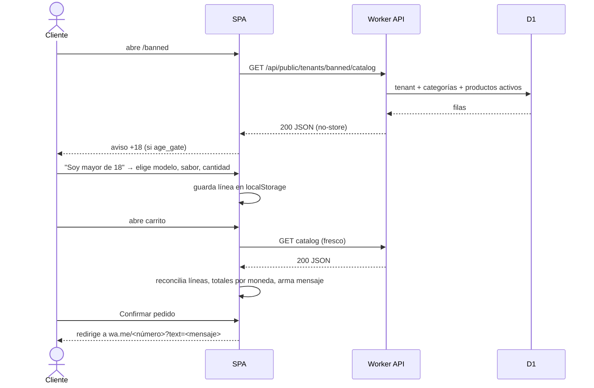
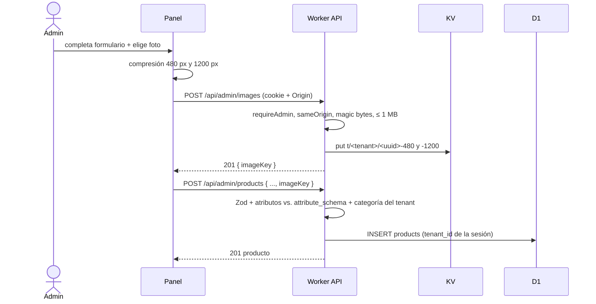
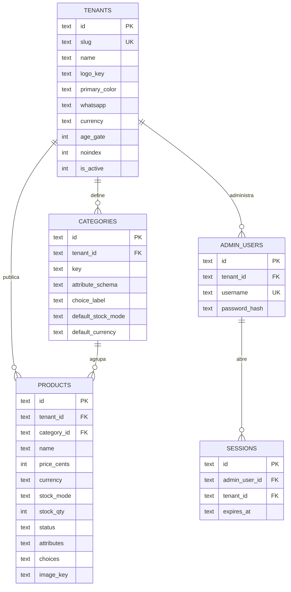

# Catálogo Web Multi-Emprendimiento (Base + Vapers + Apple) — Análisis del Arquitecto

## 0. Metadatos del Análisis

- **ID:** CATALOGO (proyecto personal, sin tracker). Trabajo organizado en tareas `CAT-01`…`CAT-11`.
- **Versión del análisis:** v1.0
- **Fecha:** 2026-09-14
- **Producido por:** Agente Arquitecto SDD (skill arquitecto-sdd)
- **Contratos analizados (una sola unidad de análisis):**
  - `CATALOGO_BASE_VAPERS_ELICITADOR_NUEVO_v1.0.md` v1.0 (plataforma base + tenant BANNED)
  - `CATALOGO_APPLE_ELICITADOR_NUEVO_v1.0.md` v1.0 (vertical Apple, tenant miphone; depende del base)
- **Puerta y modo de elicitación:** Técnica (`ing-requisitos-sdd`), D-NEW en ambos.
- **Nivel de confianza del contrato:** Medio-Alto (declarado en ambos).
- **Perfil de marcas:** Base: 24 `[USR]`, 4 `[INFER]`, 0 `[CONFLICT]`. Apple: 22 `[USR]`, 9 `[CODE]` (evidencia de planilla real, no código), 4 `[INFER]`. BDD 100 % a priori, sin tests previos. Sin escenarios de error.
- **Base de código del análisis:** greenfield — el directorio no es repositorio git; solo contiene `docs/specs/` (verificado 2026-09-14 22:16).
- **Base asumida por el contrato — verificación:** CUMPLIDA. Ambos contratos declaran greenfield sin branch ni trabajo en vuelo; se confirma.
- **Mapa del Sistema usado:** v1.0 (creado en este análisis, 2026-09-14).
- **Próximo destinatario:** Agente Ejecutor (Desarrollador SDD).
- **Planes de ejecución asociados:** `CAT-01_PLAN_EJECUTOR_v1.0.md` … `CAT-11_PLAN_EJECUTOR_v1.0.md` (ver §6.bis).

---

## 1. Resumen Ejecutivo

- Se construye **un motor de catálogo multi-tenant** sobre **Cloudflare Workers (plan Free)**: SPA React + API Hono en el mismo Worker, datos en **D1** (SQLite) y fotos en **Workers KV**. Costo $0, sin tarjeta, uso comercial permitido, link `*.workers.dev/<slug>`.
- **Vercel se descartó** (el plan Hobby prohíbe uso comercial); **Supabase se descartó** (pausa tras 7 días sin tráfico, 1 GB de fotos, upgrade USD 25); **R2 se descartó** por exigir tarjeta.
- El modelo de producto es **genérico y configurable por datos**: cada categoría define sus atributos y su opción elegible (sabor), cada producto tiene precio + moneda y modo de stock. **Apple no requiere refactor del base**: se diseñaron ambos contratos juntos.
- **Hallazgo regulatorio (INFER-04 base):** desde mayo 2026 (Disp. ANMAT 2543/2026, Res. MS 549/2026) los vapeadores se comercializan con registro RPTN, **sin saborizantes** (solo aroma a tabaco) y bajo la Ley 26.687 (publicidad prohibida salvo comunicaciones a mayores con edad verificada). **El desarrollador decidió publicar BANNED igual; el riesgo queda aceptado** y se mantienen mitigaciones gratuitas (aviso +18 bloqueante, `noindex`, previews sin fotos de producto).
- Se resolvió una **contradicción entre contratos**: Apple AC02 implicaba descuento automático de stock, fuera de alcance en el base e imposible sin checkout. Las ventas **las registra el admin** (botones "Vendido" / "Registrar venta").
- Riesgos principales: legal/ToS del tenant vape (aceptado), aislamiento entre tenants por código (mitigado con tests por endpoint), CPU de 10 ms en el login (mitigado), compatibilidad de imágenes en iPhone (fallback JPEG).
- Estimación total: **53 h de desarrollador tradicional / 23,5 h vía pipeline SDD**. Partición en **11 tareas ≤ 6 h**, en dos fases: A (base + BANNED, CAT-01…07) y B (Apple, CAT-08…11).
- Se agregan **18 escenarios de error** (E01–E18) como tests obligatorios, ausentes en los contratos.

---

## 2. Validación del Contrato del Elicitador

| Sección | Base + Vapers | Apple |
|---|---|---|
| 0. Metadatos | Validada. Sin ID de ticket → se usa `CATALOGO`/`CAT-NN`. | Validada. |
| 1. Contexto y viaje | Validada. | Validada. |
| 2. Outcomes | Validada. O4 (multi-tenant) se refuerza con test de aislamiento por endpoint. | Validada con ajuste: O1 lista categorías como familias; ver GAP-02. |
| 3. Scope | Validada. El "fuera de alcance" de stock automático rige también para Apple. | Validada. |
| 4. Constraints | Validada con hallazgo: INFER-04 resuelto con normativa 2026 (riesgo aceptado). | Validada. "AS IS" y "2x" resueltos como dato (condición) y nota de precio. |
| 5. Decisiones previas | Validada (catálogo PDF como fuente de datos de prueba). | Validada (planilla como fuente de la carga inicial). |
| 6. Task Breakdown | Validada con ajustes: re-particionado en tareas verticales ≤ 6 h (§6.bis). | Validada con ajuste: T02 reinterpretada (venta registrada por el admin). |
| 7. Criterios BDD | Validada con observación: sin escenarios de error → se agregan E01–E18. | **Conflicto interno** en AC02 (resuelto, GAP-01); AC01/AC03 usan "iPhone usado" como categoría (GAP-02). |
| 8. Gaps | Procesada (§2.bis). | Procesada (§2.bis). |

---

## 2.bis Disposición de Gaps Heredados

| Gap del contrato | Tipo | Disposición | Detalle |
|---|---|---|---|
| Base INFER-01 (stock por sabor) | Inferencia | RESUELTO (Fase 3) | Sabor = opción elegible con interruptor disponible sí/no; precio único por modelo; sin cantidad por sabor. D07. |
| Base INFER-02 (mecanismo de auth) | Inferencia | RESUELTO (Fase 3 + análisis) | Auth propia con PBKDF2 y sesiones en D1. D14. Riesgo R03. |
| Base INFER-03 (volumetría) | Inferencia | RESUELTO | Decenas de productos y tráfico bajo caben con holgura en el plan Free (Worker 100 K req/día; estáticos no cuentan; D1 5 M lecturas/día). R06. |
| Base INFER-04 (regulatorio vapes) | Inferencia | PROPAGADO → riesgo aceptado | Verificado: Disp. ANMAT 2543/2026, Res. MS 549/2026, Ley 26.687. El desarrollador eligió publicar igual. R01, R02. Mitigaciones en CAT-02 y CAT-07. |
| Base — decisión diferida: stack | Decisión | RESUELTO (Fase 3) | D01, D02. |
| Base — decisión diferida: BD/backend | Decisión | RESUELTO (Fase 3) | D1. D01. |
| Base — decisión diferida: fotos | Decisión | RESUELTO (Fase 3) | Workers KV detrás de `ImageStore`. D16. |
| Base — decisión diferida: auth | Decisión | RESUELTO | D14. |
| Base — decisión diferida: multi-tenant | Decisión | RESUELTO | Una instancia, ruteo por path. D03. |
| Base — decisión diferida: aviso +18 | Decisión | RESUELTO | Flag por tenant, bloqueante, autodeclarativo. D17. |
| Base — decisión diferida: mensaje WhatsApp | Decisión | RESUELTO | Plantilla D13; validación del número en esquema + prueba manual en CAT-07. |
| Apple INFER-01 ("2x" en accesorios) | Inferencia | RESUELTO | Nota de precio en texto libre, sin motor de descuentos. D10. |
| Apple INFER-02 (volumetría/frecuencia) | Inferencia | RESUELTO | ~60 productos, 1 admin: holgado en D1 (100 K escrituras/día). |
| Apple INFER-03 (filtrado en navegador) | Inferencia | RESUELTO | Se adopta. D11. |
| Apple INFER-04 (carga inicial) | Inferencia | RESUELTO (Fase 3) | Manual con "Duplicar". D21. CAT-11. |
| Apple — diferida: atributos por categoría | Decisión | RESUELTO | `attribute_schema` JSON por categoría. D05. |
| Apple — diferida: carga rápida | Decisión | RESUELTO | "Duplicar" con prellenado. D28. |
| Apple — diferida: diseño de filtros | Decisión | RESUELTO | D11. |
| Apple — diferida: importación desde planilla | Decisión | RESUELTO (Fase 3) | No se construye importador. D21. |
| Apple — diferida: mensaje con USD y ARS | Decisión | RESUELTO | Totales separados por moneda. D13. |
| Conflicto interno Apple AC02/T02 vs. Base §3 | Conflicto entre contratos | RESUELTO | Venta registrada por el admin; reportado como GAP-01. |

---

## 3. Diseño Técnico Propuesto

### 3.1 Arquitectura

Un único Worker de Cloudflare cumple tres roles: (1) sirve la **SPA** React compilada como *static assets* (gratis e ilimitados, fuera del cupo de requests); (2) expone la **API** Hono bajo `/api/*`; (3) sirve las **imágenes** desde KV bajo `/img/*`. En CAT-07 también intercepta la navegación HTML para inyectar título, Open Graph y `robots` por tenant.

El multi-tenant es **por path**: `/<slug>` es el catálogo público de cada tenant y `/admin` es el panel común, donde el tenant sale siempre de la sesión. Todas las tablas de negocio llevan `tenant_id`; los repositorios lo exigen como parámetro y los tests de aislamiento cubren cada endpoint de administración.

El catálogo público se entrega en **una sola respuesta JSON** por tenant (marca + categorías + productos visibles, pocos KB) sin caché, para que cualquier cambio del admin se vea al recargar. El filtrado, la búsqueda y el carrito ocurren en el navegador. El pedido es un link `wa.me` con el mensaje prellenado.

### 3.2 Componentes

- **A reutilizar (existentes):** ninguno (greenfield).
- **A modificar:** ninguno.
- **A crear:** detalle por archivo en cada plan ejecutor. Resumen por capa:
  - `src/shared/`: tipos (`types/*.types.ts`), esquemas Zod (`schemas/*.schema.ts`), lógica pura (`domain/money|visibility|attributes|cart|whatsapp|filters|color.ts`), `crypto/password.ts`, `constants.ts`.
  - `src/worker/`: `app.ts` (Hono), `routes/` (public, admin-auth, admin-products, admin-images, images, html), `middleware/` (require-admin, same-origin, security-headers), `services/` (catalog, auth, products, images/), `repositories/` (tenants, categories, products, admins, sessions), `lib/` (errors, ids, json, constants).
  - `src/web/`: `router.tsx`, `api/`, `shared/` (UI, storage seguro, theme), `features/tenant|catalog|cart|admin`.
  - `scripts/`: `tenant.ts`, `admin.ts`, `seed-dev.ts`, `lib/` (wrangler, sql), `fixtures/`.
  - `migrations/0001_tenants.sql`, `0002_catalog.sql`, `0003_auth.sql`; `tenants/*.json`.

### 3.3 Modelo de datos

| Tabla | Columnas | Notas |
|---|---|---|
| `tenants` | `id`, `slug` UNIQUE, `name`, `logo_key`, `primary_color` (#RRGGBB), `whatsapp` (solo dígitos, 10–15), `currency` (ARS/USD), `age_gate` 0/1, `noindex` 0/1, `is_active` 0/1, timestamps | Slug `^[a-z0-9-]{2,40}$`, no reservado |
| `categories` | `id`, `tenant_id`, `key`, `name`, `sort_order`, `attribute_schema` (JSON `AttributeDef[]`), `choice_label` (NULL = sin opción), `default_stock_mode`, `default_currency` | UNIQUE (`tenant_id`, `key`) |
| `products` | `id`, `tenant_id`, `category_id`, `name`, `description`, `image_key`, `price_cents` ≥ 0, `currency`, `price_note`, `stock_mode` (availability/unit/quantity), `stock_qty`, `status` (active/paused/sold), `attributes` (JSON), `choices` (JSON `{value, available}[]`), `sort_order`, timestamps | Índice (`tenant_id`, `status`) |
| `admin_users` | `id`, `tenant_id`, `username` UNIQUE NOCASE, `password_hash`, `failed_attempts`, `locked_until`, timestamps | |
| `sessions` | `id` (SHA-256 del token), `admin_user_id`, `tenant_id`, `expires_at`, `created_at` | El token nunca se persiste |

`AttributeDef = { key, label, type: 'text'|'number'|'enum', unit?, options?, required?, filter?: 'multi'|'min'|'max', showInCard? }`.

Configuración inicial: BANNED → categoría `vapes` (atributo `puffs` number, `choice_label` "Sabor", modo `availability`, ARS). miphone → `iphone`, `macbook`, `ipad`, `airpods`, `accesorios`, con atributos como `modelo`, `capacidad`, `color`, `bateria` (%, filtro mínimo), `ciclos`, `condicion` (Sellado/Usado/AS IS), etc. (detalle en CAT-09).

### 3.4 Reglas de dominio

- **Visibilidad pública** (`getHiddenReason`): oculto si `status = paused` (PAUSED), `status = sold` (SOLD), `stock_mode = quantity` y `stock_qty ≤ 0` (OUT_OF_STOCK), o si la categoría tiene opción elegible y ningún valor está disponible (NO_CHOICES_AVAILABLE). El panel muestra el motivo.
- **Stock:** `availability` = disponible/no (vapes); `unit` = unidad única, "Vendido" pasa a `sold`; `quantity` = "Registrar venta N" decrementa en forma atómica y rechaza (409) si no alcanza.
- **Dinero:** centavos enteros; formato `$26.000` (ARS) y `USD 735`; decimales solo si existen. Nunca se suman monedas distintas.
- **Carrito:** `localStorage` por tenant (`cat:cart:v1:<slug>`) guarda solo `{productId, choice, qty}`; precios y disponibilidad se toman del catálogo fresco al abrir el carrito (reconciliación: líneas no disponibles se marcan y excluyen; cantidades se recortan al stock). Máximo 50 unidades por línea y 30 líneas.
- **Mensaje de WhatsApp:** saludo con el nombre del tenant, una línea por ítem (`• 2 x NOMBRE (opción) — $52.000`, con `[ref XXXXXX]` en unidades únicas y la nota de precio si existe), total único si hay una sola moneda, o `Total en pesos` y `Total en USD` por separado.

### 3.5 Flujo de datos

1. **Cliente:** abre `/<slug>` → la SPA pide `GET /api/public/tenants/<slug>/catalog` → aplica marca → si `ageGate`, muestra el aviso antes de renderizar el catálogo → filtra en memoria → agrega al carrito (local) → en `/carrito` vuelve a pedir el catálogo, reconcilia, arma mensaje → `wa.me`.
2. **Admin:** `/admin/login` → `POST /api/admin/login` (cookie) → listado `GET /api/admin/products` → alta/edición con foto: comprime en el celular → `POST /api/admin/images` → `POST|PUT /api/admin/products` → el siguiente `GET` público ya refleja el cambio.
3. **Desarrollador:** `npm run tenant -- upsert tenants/<slug>.json --remote` y `npm run admin -- create …` para dar de alta tenants y administradores.

---

## 4. Diagramas

### 4.1 Componentes

```mermaid
graph TD
    subgraph Navegador cliente
        SPA[SPA React<br/>catálogo · filtros · carrito]
        LS[(localStorage<br/>carrito · aviso +18)]
    end
    subgraph Navegador admin
        ADM[Panel admin React<br/>lazy]
        CMP[Compresión de imágenes<br/>canvas → WebP/JPEG]
    end
    subgraph Cloudflare Worker
        ASSETS[Static Assets<br/>index.html · JS · CSS]
        API[API Hono<br/>routes → services → repositories]
        HTML[HTML por tenant<br/>title · OG · robots]
        IMG[/img/*]
    end
    D1[(D1<br/>tenants · categories · products<br/>admin_users · sessions)]
    KV[(Workers KV<br/>imágenes)]
    WA[WhatsApp wa.me]
    CLI[CLI scripts<br/>tenant.ts · admin.ts] -->|wrangler d1 / kv| D1
    CLI --> KV
    SPA --> ASSETS
    SPA --> API
    SPA --> IMG
    SPA --> LS
    SPA -->|link prellenado| WA
    ADM --> API
    CMP --> API
    API --> D1
    API --> KV
    IMG --> KV
    HTML --> D1
```

### 4.2 Secuencia — pedido del cliente



### 4.3 Secuencia — alta de producto con foto



### 4.4 Entidad-Relación



---

## 5. Riesgos Identificados

| ID | Riesgo | Categoría | Severidad | Mitigación propuesta |
|---|---|---|---|---|
| R01 | Tenant BANNED publica vapes saborizados: Res. MS 549/2026 prohíbe saborizantes y exige registro RPTN; Ley 26.687 prohíbe publicidad salvo comunicaciones a mayores con edad verificada (el aviso +18 es autodeclarativo) | Legal / heredado (INFER-04) | Alta | **Aceptado por el desarrollador (Fase 3).** El motor es neutro. Mitigaciones: aviso +18 bloqueante sin renderizar catálogo ni fotos antes de aceptar (CAT-02), `noindex` para BANNED y preview del link sin fotos de producto (CAT-07). No es asesoramiento legal. |
| R02 | Baja del Worker o de la cuenta por los términos de servicio del hosting a raíz de R01, arrastrando a todos los tenants de la instancia | Operacional | Media | Plan B sin cambios de código: desplegar el tenant en otra cuenta/entorno (`wrangler deploy --env`). Backups: Time Travel 7 días + `wrangler d1 export` documentado (CAT-07). |
| R03 | El login (PBKDF2 100 000) excede los 10 ms de CPU del plan Free | Performance / Seguridad | Media | Login infrecuente (sesión 30 días); workerd tolera excesos ocasionales; bloqueo tras 5 intentos; contraseñas generadas de ~119 bits por el CLI. Si Cloudflare corta: Workers Paid (USD 5/mes). Verificación en CAT-04 (prueba en producción en CAT-07). |
| R04 | Fuga entre tenants por un endpoint de admin sin filtro por `tenant_id` | Seguridad | Alta | Repositorios con `tenantId` obligatorio; el tenant sale solo de la sesión; recursos ajenos → 404; test de aislamiento por cada endpoint de admin (CAT-05, CAT-06, CAT-08). |
| R05 | Carrito con precios o disponibilidad viejos (producto vendido/pausado después de agregarlo) | Integración | Media | Reconciliación contra el catálogo fresco al abrir el carrito; líneas inválidas excluidas del mensaje (CAT-03, E05–E06). |
| R06 | Exceder cupos del plan Free (Worker 100 K req/día, D1 5 M lecturas/día, KV 100 K lecturas y 1 K escrituras/día) | Operacional | Baja | Volumetría esperada muy inferior; estáticos no cuentan; imágenes con caché de navegador 1 año. Monitoreo con Workers Logs; upgrade USD 5. |
| R07 | Safari no codifica WebP en canvas; fotos HEIC | Integración | Media | Fallback automático a JPEG; iOS convierte HEIC al subir por `<input type=file>`; mensaje claro si la decodificación falla (CAT-06). |
| R08 | La ruta del proyecto tiene espacios y acentos ("Alejandro Provenzano", "Catálogo") y puede romper herramientas en Windows | Operacional | Media | CAT-01 verifica `npm run dev`, tests y build en la ruta actual; si fallan por la ruta, detenerse y mover el repo a una ruta ASCII sin espacios (p. ej. `C:\dev\catalogo`). |
| R09 | Incompatibilidad de versiones entre Vite, `@cloudflare/vite-plugin`, Vitest y `@cloudflare/vitest-pool-workers` | Mantenibilidad | Media | Instalar la versión de Vitest que declara el peer dependency del pool; lockfile versionado; CAT-01 deja ambas suites corriendo antes de escribir lógica. |
| R10 | XSS, CSRF o subida de archivos maliciosos | Seguridad | Media | React escapa por defecto, sin `dangerouslySetInnerHTML`; color validado como hex; cookie `__Host-` HttpOnly/Secure/SameSite=Lax + chequeo de `Origin`; uploads por magic bytes, sin SVG, ≤ 1 MB; CSP en CAT-07. |
| R11 | Enumeración de usuarios por diferencia de tiempos en el login | Seguridad | Baja | Aceptado: respuesta idéntica (401) para usuario inexistente o clave errónea; contraseñas de alta entropía y bloqueo. No se agrega hash ficticio para no gastar CPU. |
| R12 | Imágenes huérfanas en KV (subidas sin producto guardado) | Operacional | Baja | Aceptado (1 GB alcanza para miles de fotos). Deuda registrada en el Mapa. |
| R13 | Número de WhatsApp mal cargado → pedidos que no llegan | Integración | Media | Esquema exige solo dígitos (10–15); prueba manual del link con el número real antes de publicar (CAT-07, CAT-11). |
| R14 | Políticas de comercio de WhatsApp/Meta sobre tabaco | Legal | Baja | Sin cambio incremental: el negocio ya vende por ese canal hoy. Informado. |
| R15 | Sin backups de más de 7 días | Operacional | Baja | Runbook de `wrangler d1 export` mensual en README (CAT-07). |
| R16 | Consistencia eventual de KV | Integración | Baja | Claves inmutables (UUID nuevo por subida); nunca se sobrescribe una clave. |

---

## 6. Estimación de Esfuerzo

Doble estimación por tarea: **Humano** = desarrollador con experiencia en TypeScript trabajando de forma tradicional; **IA-SDD** = horas de calendario ejecutando el plan con el agente, incluida la supervisión y corrección humana. No incluye el tiempo del emprendedor cargando productos.

| Tarea | Tareas del contrato que cubre | Humano | IA-SDD | Supuestos | Confianza |
|---|---|---|---|---|---|
| CAT-01 Esqueleto desplegado + marca del tenant | Base T01 (tenant), T05 (deploy temprano) | 6 h | 2,5 h | Cuenta Cloudflare creada por el humano | Media (toolchain nuevo, R08/R09) |
| CAT-02 Catálogo público + aviso +18 | Base T01 (producto), T03 | 6 h | 2,5 h | Datos semilla desde AC | Alta |
| CAT-03 Carrito + pedido por WhatsApp | Base T04 | 5,5 h | 2,5 h | | Alta |
| CAT-04 Login admin | Base T02 (auth) | 5,5 h | 2,5 h | | Media (R03) |
| CAT-05 ABM de productos (sin fotos) | Base T02 (CRUD) | 6 h | 3 h | Formulario dinámico por categoría | Media |
| CAT-06 Fotos y logo | Base T02 (foto) | 5 h | 2 h | | Media (R07) |
| CAT-07 Producción BANNED | Base T05 | 3,5 h | 1,5 h | Número real y logo provistos por el emprendedor | Alta |
| CAT-08 Stock por unidad y por cantidad | Apple T02 | 4 h | 2 h | | Alta |
| CAT-09 Catálogo Apple por categorías + moneda mixta + Duplicar | Apple T01, T03 | 4,5 h | 2 h | | Alta |
| CAT-10 Filtros combinados + buscador | Apple T04 | 5 h | 2 h | | Media |
| CAT-11 Producción miphone + carga inicial | Apple T05 | 2 h | 1 h | +1 h del emprendedor cargando con Duplicar | Alta |
| **Total** | | **53 h** | **23,5 h** | | |

Notas: la mayor variabilidad está en CAT-01 (primer contacto con el toolchain en Windows) y CAT-05 (formulario dinámico). La estimación IA supone que el desarrollador revisa cada tarea al cerrarla.

### 6.bis Partición aplicada

**Gate de granularidad:** total 53 h > 8 h → partición obligatoria en tareas ≤ 6 h humanas. Criterio de corte: rebanadas verticales por outcome/criterio de aceptación; cada tarea termina en algo verificable por sí mismo. Sin tickets en tracker (proyecto personal, decisión del desarrollador): las tareas se identifican `CAT-NN` y cada una tiene su plan ejecutor. Se descartó la conversión a épica por el mismo motivo; las tareas se agrupan en dos fases.

| Tarea | Fase | Alcance verificable | Criterios de aceptación y errores | Depende de |
|---|---|---|---|---|
| CAT-01 | A | `…workers.dev/banned` muestra la marca de BANNED; slug inexistente → 404 | AC06 (parcial), E01 | — |
| CAT-02 | A | Catálogo público de solo lectura con aviso +18 y datos semilla | AC01, AC02, AC06, E02, E03 | CAT-01 |
| CAT-03 | A | Carrito local y pedido por WhatsApp | AC04, E04–E07 | CAT-02 |
| CAT-04 | A | Login admin con sesión y bloqueo | AC05 (parcial), E08–E11 | CAT-01 (paralelizable con 02–03) |
| CAT-05 | A | ABM de productos sin fotos, sabores con interruptor | AC02, AC03, AC05, E12, E13 | CAT-02, CAT-04 |
| CAT-06 | A | Fotos comprimidas y logo | AC01 y AC03 con foto, E14 | CAT-05 |
| CAT-07 | A | BANNED en producción (HTML por tenant, CSP, alta real, smoke en celulares) | AC01–AC06 en producción | CAT-03, CAT-06 |
| CAT-08 | B | Stock por unidad/cantidad, "Vendido", "Registrar venta" | Apple AC02 (reinterpretado), AC04, E15, E16 | CAT-05 |
| CAT-09 | B | Tenant miphone con categorías/atributos, catálogo por secciones, nota de precio, moneda mixta, Duplicar | Apple AC01, AC05, AC06 | CAT-03, CAT-05 |
| CAT-10 | B | Filtros combinados y buscador | Apple AC03, E17, E18 | CAT-09 |
| CAT-11 | B | miphone en producción + carga inicial | Apple T05 | CAT-07, CAT-08, CAT-10 |

Orden sugerido: CAT-01 → CAT-02 → CAT-03 → CAT-04 → CAT-05 → CAT-06 → CAT-07 → CAT-08 → CAT-09 → CAT-10 → CAT-11. CAT-04 puede adelantarse en paralelo a CAT-02/03.

---

## 7. Decisiones de Diseño Tomadas

1. **D01 — Cloudflare Workers + D1 + Workers KV, plan Free.** Uso comercial permitido, sin pausas, sin tarjeta, upgrade de USD 5. Alternativas: Vercel (prohíbe uso comercial), Supabase (pausa a 7 días, USD 25), Firebase (Storage exige plan Blaze), Git-CMS (no cumple inmediatez ni aislamiento). Origen: Fase 3.
2. **D02 — SPA React 19 + Vite + TypeScript + Tailwind v4 + React Router;** panel admin cargado en diferido. Se prefirió SPA sobre SSR para no gastar CPU del Worker (límite 10 ms) renderizando HTML. Origen: análisis.
3. **D03 — Una instancia multi-tenant, ruteo por path** `/<slug>`; slugs reservados `admin`, `api`, `img`, `assets`. Sin subdominios (no hay dominio propio). Origen: análisis (decisión diferida).
4. **D04 — API Hono en el mismo Worker que sirve la SPA** (Workers Static Assets, `run_worker_first` para `/api/*` e `/img/*`; en CAT-07 también la navegación HTML). Origen: análisis.
5. **D05 — Atributos por categoría como datos** (`attribute_schema` JSON) + formulario y filtros generados a partir del esquema. Alternativa descartada: una tabla por categoría (migración por cada vertical). Origen: análisis (decisión diferida Apple).
6. **D06 — Categoría = familia; condición = atributo** enum (Sellado/Usado/AS IS). "Categoría iPhone usado" de los AC = categoría `iphone` + condición `Usado`. Origen: análisis (GAP-02).
7. **D07 — Sabor = opción elegible con disponible sí/no;** precio único por modelo; producto sin opciones disponibles queda oculto. Origen: Fase 3.
8. **D08 — Modo de stock por producto** (`availability`/`unit`/`quantity`) con valor por defecto en la categoría; ventas registradas manualmente. Origen: análisis (GAP-01).
9. **D09 — Precios en centavos enteros + moneda** ARS/USD; totales por moneda; sin conversión. Moneda por defecto en tenant y categoría. Origen: análisis.
10. **D10 — "2x" como nota de precio en texto libre,** mostrada en tarjeta, carrito y mensaje. Origen: análisis (Apple INFER-01).
11. **D11 — Filtros en el navegador,** estado en la URL; AND entre filtros, OR dentro de un filtro de selección múltiple; filtro de precio atado a una moneda (excluye productos de la otra); búsqueda sin acentos ni mayúsculas, todas las palabras deben aparecer. Origen: análisis.
12. **D12 — Carrito en `localStorage` por tenant, reconciliado al abrirlo;** no se vacía solo al confirmar (se ofrece "Vaciar carrito" tras redirigir). Origen: análisis.
13. **D13 — Plantilla del mensaje de WhatsApp** definida en §3.4, con strings exactos cubiertos por tests. Origen: análisis.
14. **D14 — Auth propia:** PBKDF2-SHA256 100 000 (máximo de workerd), sesiones opacas en D1 (se guarda el hash del token), cookie `__Host-cat_session` 30 días, bloqueo 5 intentos/15 min, chequeo de `Origin`. Origen: Fase 3 + análisis.
15. **D15 — Alta de tenants, categorías y admins por CLI** (`tsx` + `wrangler d1/kv`) desde JSON versionado; sin panel de superadmin. Cumple "crear tenant sin tocar código". Origen: análisis.
16. **D16 — Imágenes en Workers KV** detrás de `ImageStore`; claves `t/<tenantId>/<uuid>-480|-1200`; compresión en el navegador (WebP, fallback JPEG). Origen: Fase 3 + análisis.
17. **D17 — Aviso +18 por tenant, bloqueante y autodeclarativo;** `noindex` por tenant. Origen: análisis.
18. **D18 — HTML por tenant** con título, Open Graph (logo, nunca fotos de producto si `age_gate`) y `robots`, inyectado con HTMLRewriter. Origen: análisis.
19. **D19 — Catálogo `no-store`; imágenes `immutable` 1 año.** Origen: análisis.
20. **D20 — Estrategia de tests:** Vitest + Testing Library (unit/UI), `vitest-pool-workers` (integración con D1/KV locales), smoke manual en celulares para producción. Origen: análisis.
21. **D21 — Carga inicial de miphone manual con "Duplicar";** sin importador. Origen: Fase 3.
22. **D22 — Trabajo organizado en 11 tareas `CAT-NN` sin tracker.** Origen: Fase 3.
23. **D23 — BANNED se publica al terminar la fase A; riesgo regulatorio aceptado.** Origen: Fase 3.
24. **D24 — Estructura `src/shared|worker|web` por responsabilidad;** tipos, esquemas y constantes en archivos propios; tests colocados; identificadores en inglés y textos en español. Convención inaugural del proyecto (Mapa §3). Origen: análisis.
25. **D25 — Formato de error uniforme** `{ error: { code, message, details? } }`. Origen: análisis.
26. **D26 — Sin panel de configuración del tenant ni de categorías en v1** (se edita el JSON y se re-ejecuta el CLI). Origen: análisis (fuera de alcance de los contratos).
27. **D27 — Duplicar = prellenado en el cliente** (sin endpoint), compartiendo la foto; una foto se borra de KV solo si ningún otro producto la referencia. Origen: análisis.
28. **D28 — npm como gestor de paquetes** (Node 22 LTS instalado); `wrangler` como devDependency, sin instalación global. Origen: análisis.

---

## 8. Gaps Reportados al Elicitador

- **GAP-01:** Apple AC02 y T02 dicen que la cantidad baja "cuando un cliente compra", lo que contradice el fuera de alcance del contrato base (sin descuento automático) y es inviable (el pedido se cierra por WhatsApp). Acción sugerida: v1.1 del contrato Apple con "Cuando el administrador registra la venta de 2 unidades…".
- **GAP-02:** Apple AC01/AC03 usan "iPhone usado" como categoría, pero el Outcome 1 define las categorías como familias. Acción sugerida: reescribir como categoría "iPhone" + condición "Usado".
- **GAP-03:** Ningún contrato trae escenarios de error. El análisis agrega E01–E18 (ver planes). Acción sugerida: incorporarlos a la sección 7 en v1.1.
- **GAP-04:** Base INFER-04 quedó resuelto con normativa verificada (Res. MS 549/2026, Disp. ANMAT 2543/2026, Ley 26.687) y riesgo aceptado. Acción sugerida: actualizar la sección 4 del contrato base.
- **GAP-05:** Base INFER-01 resuelto (interruptor por sabor). Acción sugerida: actualizar secciones 0, 5 y 8 del contrato base.
- **GAP-06:** Base T01 "crear tenant sin tocar código": se implementa por CLI + JSON, sin interfaz. Acción sugerida: aclararlo en el contrato.
- **GAP-07 (menor):** Apple AC01 usa color "Natural" citando la fila 27 de la planilla, que dice "White". Dato de prueba; no afecta el diseño.

---

## 9. Actualizaciones Sugeridas al Mapa del Sistema

Ninguna: el Mapa v1.0 se generó en este análisis y describe la arquitectura objetivo. Sugerencia de proceso: al cerrar CAT-07 y CAT-11, refrescar el Mapa (v1.1, v1.2) para pasar de "arquitectura objetivo" a "estado implementado" con el commit real.

---

## 10. Plan de Ejecución

Un plan autocontenido por tarea, en `docs/specs/`:

`CAT-01_PLAN_EJECUTOR_v1.0.md` · `CAT-02_…` · `CAT-03_…` · `CAT-04_…` · `CAT-05_…` · `CAT-06_…` · `CAT-07_…` · `CAT-08_…` · `CAT-09_…` · `CAT-10_…` · `CAT-11_PLAN_EJECUTOR_v1.0.md`

### Matriz de trazabilidad (criterio → tarea que lo verifica)

| Criterio | Tarea(s) | Tipo de verificación |
|---|---|---|
| Base AC01 | CAT-02 (sin foto), CAT-06 (con foto), CAT-07 (prod) | Integración Worker + UI + smoke |
| Base AC02 | CAT-02 (dato), CAT-05 (panel) | Integración Worker |
| Base AC03 | CAT-05, CAT-06 | Integración Worker (incluye "no aparece en otro tenant") |
| Base AC04 | CAT-03 | Unit (mensaje exacto, total $80.000) + UI |
| Base AC05 | CAT-04, CAT-05, CAT-06, CAT-08 | Integración Worker por endpoint |
| Base AC06 | CAT-01, CAT-02, CAT-07 | Integración Worker + smoke |
| Apple AC01 | CAT-09 | Integración Worker + UI |
| Apple AC02 (reinterpretado) | CAT-08 | Integración Worker |
| Apple AC03 | CAT-10 | Unit (filtros) + UI |
| Apple AC04 | CAT-08 | Integración Worker |
| Apple AC05 | CAT-09 | Unit (mensaje con dos monedas) |
| Apple AC06 | CAT-09 | Integración Worker (valores nuevos + `no-store`) |
| E01–E18 | CAT-01…CAT-10 (según tabla §6.bis) | Integración / Unit / UI |

---

## CHANGELOG

- v1.0 (2026-09-14): Versión inicial del análisis. Contratos base y Apple v1.0 analizados como unidad. Decisiones de Fase 3: Cloudflare completo, publicar BANNED con riesgo aceptado, interruptor por sabor, carga manual con Duplicar, tareas sin tracker, imágenes en Workers KV.
